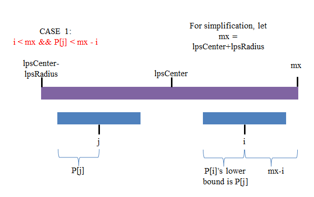
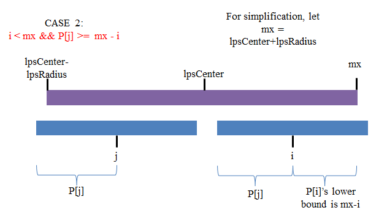

##Dynamic Programming
<a name="AnchorIndex" id="AnchorIndex"></a>
Index:  
-[Leetcode:Best Time to Buy and Sell Stock III](#Anchor1)  
-[Leetcode:Decode Ways](#Anchor2)  
-[LeetCode:Interleaving String](#Anchor3)  
-[LeetCode:Wildcard Matching](#Anchor4)  
-[LeetCode:Trapping Rain Water](#Anchor5)  
-[Leetcode:Palindrome Partitioning II](#Anchor6)  
-[Leetcode:Longest Palindromic Substring](#Anchor7)  
-[Leetcode:Distinct Subsequences](#Anchor8)  
-[LCS](#Anchor9)  
-[LIS](#Anchor10)  
-[LeetCode:Edit Distance](#Anchor11)  
-[LeetCode:Palindrome Partitioning](#Anchor12)  
-[Divide Array To Make Two Equal Part](#Anchor13)  

-------
<a name="Anchor1" id="Anchor1"></a>
-**[Leetcode:Best Time to Buy and Sell Stock III](http://oj.leetcode.com/problems/best-time-to-buy-and-sell-stock-iii/)**([Back to Index](#AnchorIndex))     
  
分别记录到i时，0-i的最大利润和i+1到len-1的最大利润，相加即可。具体做法是
  * 使用forwardMax[i]记录0到i的最大利润（正向）
  * 使用backwardMax[i]记录n-1到i的最大利润（反向）
```java
public class Solution {
    public int maxProfit(int[] prices) {
        if (prices == null || prices.length < 2) return 0;
        int[] forwardMax = new int[prices.length];
        int[] backwardMax = new int[prices.length];
        
        int buyPoint = prices[0];
        int sellPoint = prices[0];
        int maxProfit = 0;
        forwardMax[0] = 0;
        
        for (int i = 1; i < prices.length; i++) {
            if (prices[i] < buyPoint) {
                buyPoint = prices[i];
            }
            forwardMax[i] = Math.max(prices[i] - buyPoint, forwardMax[i - 1]);
        }
        sellPoint = prices[prices.length - 1];
        backwardMax[prices.length - 1] = 0;
        
        for (int i = prices.length - 2; i >= 0; i--) {
            if (prices[i] > sellPoint) {
                sellPoint = prices[i];
            }
            backwardMax[i] = Math.max(sellPoint - prices[i], backwardMax[i + 1]);
        }
        
        int max = 0;
        for (int i = 0; i < prices.length - 1; i++) {
            if (forwardMax[i] + backwardMax[i + 1] > max) {
                max = forwardMax[i] + backwardMax[i + 1];
            }
        }
        if (max < Math.max(forwardMax[prices.length - 1], backwardMax[0])) {
            max = Math.max(forwardMax[prices.length - 1], backwardMax[0]);
        }
        return max;
    }
}
```

-------
<a name="Anchor2" id="Anchor2"></a>
-**[Leetcode:Decode Ways](http://oj.leetcode.com/problems/decode-ways/)**([Back to Index](#AnchorIndex))   
分析题意可以发现字符串s的子串s.substr(0,i)对s.substr(0,i-1)和s.substr(0,i-2)存在依赖关系，即可以将原问题分解为小的子问题求解，通过记录子问题求解的结果来快速计算当前问题的结果。当字符串长度为1时，需要dp[0] = 1作为虚拟的初始子问题解。  

一般的,dp[i]表示s.substr(0,i)的解码方式数量，则dp数组的求解过程如下：

```cpp
class Solution {
public:

    int numDecodings(string s) {
        int n = s.size();
        if(n <= 0) return 0;
        int dp[n+1];
        memset(dp, 0, sizeof(dp));
        dp[0] = 1;
        for(int i = 1; i <= n; i++){
            if(s[i-1] == '0'){
                if(i == 1 || !(s[i-2] == '1' || s[i-2] == '2')){
                    dp[i] = 0;
                }else{
                    dp[i] += dp[i-2];
                }
            }else if(s[i-1] >= '1' && s[i-1] <= '6'){
                dp[i] = dp[i-1];
                if(i != 1 && (s[i-2] == '1' || s[i-2] == '2')){
                    dp[i] += dp[i-2];
                }
            }else{
                dp[i] = dp[i-1];
                if(i != 1 && s[i-2] == '1'){
                    dp[i] += dp[i-2];
                }
            }
        }
        return dp[n];
    }
};
```

-------
<a name="Anchor3" id="Anchor3"></a>
-**[LeetCode:Interleaving String](http://oj.leetcode.com/problems/interleaving-string/)**([Back to Index](#AnchorIndex))   

仔细观察可知，s3的子串需要由s1和s2的子串混合而成，但要求每次从s1和s2中随机按序取出，因此可以使用DP。  

dp[i][j]表达的意思是s3中的前（i+j）长度串是否为 s1中的前i长度串与 s2中的前j长度串混合组成，对于 i >= 1 和 j >= 1有：

                true, if s1[i-1] == s3[i+j-1] && dp[i-1][j] == true
    dp[i][j] =  true, if s2[j-1] == s3[i+j-1] && dp[i][j-1] == true
                false, otherwise

若s1的下标为i-1的字符与s3的下标为i+j-1的字符相同，且s1的前i-1子串与s2的前j子串能够拼合成s3的前i+j-1子串，则s1的前i子串可以与s2的前j串拼合成s3的前i+j子串，调换s1和s2的角色亦然。可以简单的理解为此时从s1中选取了下标为i-1的字符作为s3的下标为i+j-1的字符。
  
```java  
public class Solution {
    public boolean isInterleave(String s1, String s2, String s3) {
        if (s3.length() != s1.length() + s2.length())
            return false;
        if (s1.length() == 0)
            if (!s2.equals(s3))
                return false;
            else
                return true;
        if (s2.length() == 0)
            if (!s1.equals(s3))
                return false;
            else
                return true;
        boolean[][] dp = new boolean[s1.length() + 1][s2.length() + 1];
        dp[0][0] = true;

        for (int i = 1; i <= s1.length(); i++)
            if (dp[i - 1][0] && s1.charAt(i - 1) == s3.charAt(i - 1))
                dp[i][0] = true;

        for (int j = 1; j <= s2.length(); j++)
            if (dp[0][j - 1] && s2.charAt(j - 1) == s3.charAt(j - 1))
                dp[0][j] = true;

        for (int i = 1; i <= s1.length(); i++)
            for (int j = 1; j <= s2.length(); j++) {
                if (dp[i - 1][j] && s1.charAt(i - 1) == s3.charAt(i + j - 1))
                    dp[i][j] = true;
                if (dp[i][j - 1] && s2.charAt(j - 1) == s3.charAt(i + j - 1))
                    dp[i][j] = true;
            }

        return dp[s1.length()][s2.length()];
    }

    public static void main(String[] args) {
        Solution m = new Solution();
        String s1 = "aabccabc";
        String s2 = "dbbabc";
        String s3 = "aabdbbccababcc";
        boolean result = m.isInterleave(s1, s2, s3);
        System.out.print(result);
    }
}
```  

-------
<a name="Anchor4" id="Anchor4"></a>
-**[LeetCode:Wildcard Matching](http://oj.leetcode.com/problems/wildcard-matching/)**([Back to Index](#AnchorIndex)) 
  
这道题dp[i][j]表达的意思是s1长度为i的串是否和s2中长度为j的串匹配。但这道题有一个小技巧，就是用s2的字符去匹配s1的字符。当s2的第j个字符是\*时，这里有两种选择：既可以让\*去匹配s1的一个字符，使i前进1，也可以把*当成空白，此时dp[j][i]的状态就等于dp[j-1][i]的状态。当s2遇到?时，和s1的第i个字符与s2的第j个字符相等是等效的，此时dp[j][i]=dp[j-1][i-1] 

```cpp  
class Solution {   
public:

  bool isMatchDp(string& t, string& p){
    int tLen = t.length();
    int pLen = p.length();
    
    bool dp[pLen+1][tLen+1];
    memset(dp, 0, sizeof(dp));
    
    dp[0][0] = true;
    
    for(int i = 1; i <= pLen; i++){
        if(dp[i-1][0]&&p[i-1]=='*'){
            dp[i][0] = true;
        }
    }
    
    for(int i = 1; i <= pLen; i++){
        for(int j = 1; j <= tLen; j++){
            if((p[i-1] == '?')||p[i-1] == t[j-1]){
                dp[i][j] = dp[i-1][j-1];
            }else if(p[i-1] == '*'){
                dp[i][j] = dp[i-1][j]||dp[i][j-1];
            }else{
                dp[i][j] = false;
            }
        }
    }
    
    return dp[pLen][tLen];
    }
};   
```  

-------
<a name="Anchor5" id="Anchor5"></a>
-**[LeetCode:Trapping Rain Water](http://oj.leetcode.com/problems/trapping-rain-water/)**([Back to Index](#AnchorIndex))  

转换思路，将整个容器能够容纳的水划分为每个柱子上方的容水量C[i]  
    
    * C[i] = Min{LeftHighest[i],RightHighest[i]} - A[i] 

其中，LeftHighest[i]是柱子i左侧的最高柱高度（不包括自身），RightHighest[i]是柱子i右侧的最高柱高度（不包括自身），A[i]是柱子i的高度。LeftHighest和RightHighest可以用dp求解，最后对C[i]求和即可得到结果。

```cpp
class Solution {
public:
    int trap(int A[], int n) {
        if(n<=2) return 0;
        int units = 0;
        vector<int> leftHighest;
        leftHighest.resize(n);
        leftHighest[0] = 0;
        for(int i = 1; i<=n-1; i++){
            if(A[i-1] < leftHighest[i-1]){
                leftHighest[i] = leftHighest[i-1];
            }else{
                leftHighest[i] = A[i-1];
            }
        }
        
        int rightHighest = 0, tempUnit = 0;
        for(int j = n-2; j>=1; j--){
            if(A[j+1]>rightHighest){
                rightHighest = A[j+1];
            }
            tempUnit = min(leftHighest[j],rightHighest)-A[j];
            if(tempUnit <= 0) continue;
            units += tempUnit;
        }
        return units;
    }
};
```

-------
<a name="Anchor6" id="Anchor6"></a>
-**[Leetcode:Palindrome Partitioning II](http://oj.leetcode.com/problems/palindrome-partitioning-ii/)**([Back to Index](#AnchorIndex))  
 
参考[LeetCode:Palindrome Partitioning](#Anchor12)的做法可以在O(n^2)的时间内求出字符串s的所有子串是否为回文串的信息，matrix[i][j]表示字符串s的下标从i到j的子串是否为回文串，dp转移方程略。

在获得上述信息的情况下，使用另外一个一维数组来求解最小切分数。dp[i]表示下标从i到len-1的子串能够被分为多少个回文断，则我们要求解的最终目标变成了dp[0]-1，该dp转移方程为：

    * dp[i] = min(dp[i], dp[j+1]+1), if matrix[i][j] == true

每当我们确定i到j为一个回文子串，我们尝试比较dp[i]和dp[j+1]+1的值，最终求出目标值。

```cpp
class Solution {
public:
    int minCut(string s) {
        int len = s.size();  
        int* dp = new int[len+1];  
        for(int i=len; i>=0; i--)  
            dp[i] = len-i;  
        bool** matrix = new bool*[len];  
        for(int i=0; i<len; i++)  
        {  
            matrix[i] = new bool[len];  
            memset(matrix[i], false, sizeof(bool)*len);  
        }  
        for(int i=len-1; i>=0; i--)  
            for(int j=i; j<len; j++)  
            {  
                if(s[i] == s[j] && (j-i<2 || matrix[i+1][j-1]))  
                {  
                    matrix[i][j] = true;  
                    dp[i] = min(dp[i], dp[j+1]+1);  
                }  
            }  
        return dp[0]-1;  
    } 
};
```

-------
<a name="Anchor7" id="Anchor7"></a>
-**[Leetcode:Longest Palindromic Substring](http://oj.leetcode.com/problems/longest-palindromic-substring/)**([Back to Index](#AnchorIndex))  

O(n^3)暴力法略过不提，O(n^2)的方法可以参考[LeetCode:Palindrome Partitioning](#Anchor12)，在计算所有子串是否是回文串的过程中得到最长回文子串。

下面介绍的方法为Manacher算法，可以在O(n)时间内求出最长回文子串。该算法的核心思想是**利用已有的最长回文子串简化后续求解过程**。首先定义三个变量：

    * lpsCenter： 已有的最长回文子串的中心位置
    * lpsRadius： 已有的最长回文子串的半径(从中心位置到边缘，包括中心位置)
    * P[i]: 记录了以下标i为中心的最长回文子串的半径

另外，需要对原字符串做一定的预处理，也即在原字符串中插入特定字符（如'#'）使得我们总是在处理长度为奇数的字符串，统一了奇偶情况：
    
    * "abcde" => "#a#b#c#d#e#"
    * "abba" => "#a#b#b#a#"

如果算法能够得到lpsCenter和lpsRadius，就能够还原出原字符串中的最长回文子串。接下来将结合图片来解释该算法的核心。

当我们已经得到以0到i-1下标为中心的最长回文子串半径P[k], k∈[0,i-1]，且从中得到了lpsCenter和lpsRadius，若i满足一定条件时，则计算P[i]时可以利用已有的信息。对于Case 1，j为i关于lpsCenter对称位置，也即

    * lpsCenter - j == i - lpsCenter => j = 2 * lpsCenter - i

  

在Case 1，容易看出以j为中心的回文子串保证了以i为中心也**至少**存在相同的回文子串，这是由于当前最长回文子串的lpsRadius（实际上就是P[lpsCenter]）与P[j]的大小关系决定了，也即**P[i] >= P[j]**

  

在Case 2，当前最长回文子串的lpsRadius与P[j]的大小关系无法保证以i为中心的回文子串与以j为中心的一致，则此时**P[i] >= mx-i**

对于i < mx 而言，上述两种情况仅仅是得到了P[i]的下界，对于i+P[i]和i-P[i]以外的情况，仍然需要逐个字符比较得到。

如果i本身已经超出当前最大回文子串的覆盖半径(i >= mx)如何处理？简单的令P[i] = 1,接下来逐字符比较即可。

```cpp
// Suppose we have no '#' in the original string s
string LPS(string s){
    if(s.size() == 0) return "";
    string t = preProcess(s);
    int n = t.size();
    int P[n];
    memset(P, 0, sizeof(P));
    int mx = 0, lpsCenter = 0;
    for(int i = 1; i <= n-1; i++){
        int j = 2 * lpsCenter - i;
        if(mx > i){
            P[i] = min(P[j], mx - i);
        }else{
            P[i] = 1;
        }
        //Search more
        while(t[i-P[i]] == t[i+P[i]]){
            P[i]++;
        }
        //Update global info
        if(i+P[i] > mx){
            mx = i + P[i];
            lpsCenter = i;
        }
    }

    //get the LPS in the original string s
    string ret;
    for(int i = lpsCenter - P[lpsCenter] + 1; i <= lpsCenter + P[lpsCenter] -1; i++){
        if(t[i] != '#'){
            ret += t[i];
        }
    }
    return ret;
} 

// Add '#' in the original string and return
string preProcess(string s){
    string ret;
    ret += '#'
    for(int i = 0; i <= s.size()-1; i++){
        ret += s[i];
        ret += '#';
    }
    return ret;
}

```

-------
<a name="Anchor8" id="Anchor8"></a>
-**[Leetcode:Distinct Subsequences](http://oj.leetcode.com/problems/distinct-subsequences/) **([Back to Index](#AnchorIndex))  

二维数组dp[T][S]，用来记录匹配子序列的个数。
    
    * dp[0][0] = 1;  T和S都是空串
    * dp[0][1 ... S.length() - 1] = 1;  T是空串，S只有一种子序列匹配
    * dp[1 ... T.length() - 1][0] = 0;  S是空串，T不是空串，S没有子序列匹配
    * dp[i][j] = dp[i][j - 1] + (T[i - 1] == S[j - 1] ? dp[i - 1][j - 1] : 0).1 <= i <= T.length(), 1 <= j <= S.length()

```cpp
public class Solution {
    public int numDistinct(String S, String T) {
        // Start typing your Java solution below
        // DO NOT write main() function
        int[][] dp = new int[T.length() + 1][S.length() + 1];
        dp[0][0] = 1;
        for (int i = 1; i <= T.length(); i++) {
            dp[i][0] = 0;
        }
        for (int j = 1; j <= S.length(); j++) {
            dp[0][j] = 1;
        }
        for (int i = 1; i <= T.length(); i++) {
            for (int j = 1; j <= S.length(); j++) {
                dp[i][j] = dp[i][j - 1];
                if (T.charAt(i - 1) == S.charAt(j - 1)) {
                    dp[i][j] += dp[i - 1][j - 1];
                }
            }
        }
        return dp[T.length()][S.length()];

    }
}
```

-------
<a name="Anchor9" id="Anchor9"></a>
-**[LCS]**([Back to Index](#AnchorIndex)) 

输入两个字符串，求它们的最长公共子序列(LCS)长度，并打印出最长公共子序列。 
  
经典的动态规划问题。dp[i][j]表示p1的前i的个字符和p2的前j个字符匹配的最大长度。定位到dp[i][j]。若p1中的第i个字符与p2的第j个字符相等，则dp[i][j]=dp[i-1][j-1]+1;若不相等，则为dp[i-1][j]和dp[i][j-1]中较大的一个。关键问题是如何打印最长公共子序列。这里我们可以再使用一个二维数组mark来标记当前的状态是从哪一个状态得来。mark[i][j]有三个值，分别为1 2 3,1表示由dp[i-1][j]得来，2表示由dp[i-1][j-1]得来，3表示由dp[i][j-1]得来。当得到最长公共子序列的长度后，dp[p1.length()-1][p2.length()-1]开始向前查找，mark[i][j]为1 i--，为3 j--，为2 i-- j--并将当前值填入结果数组。最后将数组逆序输出即可。  

```java  
import java.util.ArrayList;

public class MyOwn {
    public void LCS(char[] a, char[] b) {
        int len1 = a.length;
        int len2 = b.length;
        int[][] dp = new int[len1 + 1][len2 + 1];
        char[][] mark = new char[len1 + 1][len2 + 1];

        for (int i = 0; i <= len1; i++)
            dp[i][0] = 0;
        for (int i = 0; i <= len2; i++)
            dp[0][i] = 0;
        for (int i = 1; i <= len1; i++)
            for (int j = 1; j <= len2; j++) {
                if (a[i - 1] == b[j - 1]) {
                    dp[i][j] = dp[i - 1][j - 1] + 1;
                    mark[i][j] = '2';
                } else {
                    if (dp[i][j - 1] >= dp[i - 1][j]) {
                        dp[i][j] = dp[i][j - 1];
                        mark[i][j] = '3';
                    } else {
                        dp[i][j] = dp[i - 1][j];
                        mark[i][j] = '1';
                    }
                }
            }

        System.out.println(dp[len1][len2]);
        ArrayList<Integer> l = new ArrayList<Integer>();
        int i = len1;
        int j = len2;
        while (i >= 0 && j >= 0) {
            if (mark[i][j] == '1')
                i--;

            else if (mark[i][j] == '3')
                j--;

            else {
                l.add(i);
                i--;
                j--;
            }
        }
        for (i = l.size() - 1; i >= 0; i--)
            System.out.print(a[l.get(i)] + " ");
    }
}
```  

-------
<a name="Anchor10" id="Anchor10"></a>
-**[LIS]**([Back to Index](#AnchorIndex)) 
最长上升子序列（LIS），给出一个序列a1,a2,a3,a4,a5,a6,a7….an,求它的一个子序列（设为s1,s2,…sn），使得这个子序列满足这样的性质，s1,s2,s3…sn递增并且这个子序列的长度最长。输出这个最长的长度。等效问题：求解一个数列中需要调整（取出一个数并插入新的位置）的最少次数使得该数列有序，一次调整操作如将1,2,4,6,5,3变换为1,2,3,4,6,5。
  
如果仅仅是求解LIS的长度，可以使用一个栈模拟当前最大递增子序列的长度，当元素大于栈顶，最长序列+1，否则替换第一个比该元素大的栈内元素，保持栈内序列的“最大潜力”，该解法的时间复杂度为O(nlgn)。例如对于1,2,3,6,4序列，1、2和3顺序入栈，代表当前最大长度为3，当遍历到6时，仍然大于栈顶，入栈，当前最大长度为4，当遍历到4时，寻找第一个比4大的元素并替换，栈内为1,2,3,4，故最大长度为4。但需要注意的是，该算法结束后栈内的序列并不是我们所求的LIS，仅仅是长度相同而已。

```cpp
int LIS(int A[], int n){
    vector<int> vec;//这里我们是用一个vector来模拟stack，方便二分查找
    for(int i= 0; i <= n-1;i++){
        if(vec.empty()||A[i]>=vec.back()){
            vec.push_back(A[i]);
        }else{
            int start = 0, end = vec.size()-1;
            while(start <= end){
                if(start == end){
                    if(vec[start] > A[i]){
                        vec[start] = A[i];
                    }else if(vec[start]<A[i]){
                        vec[start+1] = A[i];
                    }else if(vec[start] == A[i]){
                        break;
                    }
                }
                int mid = (start + end) / 2;
                if(vec[mid] == A[i]){
                    break;
                }else if(vec[mid] < A[i]){
                    start = mid + 1;
                }else{
                    end = mid - 1;
                }
            }
        }
    }
    return vec.size();
}
```

如果变更题目要求：求LIS序列，则存在动态规划解法。假设dp[i]记录了以A[i]结尾的最长上升子序列的长度，假设输入数组A的长度为n，则该动态转移方程为：
    
    * dp[i] = max(dp[k] + 1), 0 <= k <= i-1, A[i] > A[k], 0 <= i <= n-1

同时因为我们需要求解该LIS序列，则使用lastPos[i]来记录以A[i]结尾的最长上升子序列的倒数第二元素的位置，也即该上升序列中排在A[i]前一个的元素，每次更新dp[i]时更新lastPos[i]，在计算dp[i]完成后，从后向前还原LIS序列。

```cpp
vector<int> LIS(int A[], int n){
    if(n <= 0) return;
    int dp[n]; // dp[i] records len of LIS using A[i] as the last element 
    int lastPos[n]; // lastPos[i] records the previous element in the LIS using A[i] as the last element
    for(int i = 0; i <= n-1; i++){
        dp[i] = 1;// at least 1
        lastPos[i] = 0;// whatever
    }
    int lenOfMaxLIS = 0, lastPosOfMaxLIS = 0;
    for(int i = 1; i <= n-1; i++){
        for(int j = 0; j <= i-1; j++){
            if(A[j] > A[i] && dp[j] + 1 > dp[i]){
                dp[i] = dp[j] + 1;
                lastPos[i] = j;
                if(dp[i] > lenOfMaxLIS){ // update global info
                    lenOfMaxLIS = dp[i];
                    lastPosOfMaxLIS = i;
                }
            }
        }
    }
    vector<int> lisVector;
    for(int i = lastPosOfMaxLIS; i >= 0; ){
        lisVector.push_back(A[i]);
        i = lastPos[i];
    }
    reverse(lisVector.begin(), lisVector.end());
    return lisVector;
}
```
那么求解LIS序列也存在O(nlogn)的解法，使用了特殊的数据结构，待续。  

-------
<a name="Anchor11" id="Anchor11"></a>
-**[LeetCode:Edit Distance](http://oj.leetcode.com/problems/edit-distance/)**([Back to Index](#AnchorIndex)) 
  
求两个字符串的最小距离。在本题中，dp同时起到了标记和记录状态的作用，表示s1中前面长度为i的串和s2中前面长度为j的串匹配的最小距离。用过dfs的同学都知道，一般dfs是当遍历到末尾才开始返回值的，本题dfs的目的就是返回dp[i][j]的最小值。既然返回的是最小值，所以对于每一个dp[i][j]来说，只要遍历过一遍就够了，第一次遍历赋值，第二次遍历到dp[i][j]直接返回dp[i][j]的值。然后关注当前状态dp[i][j]。若s1中第i个字符和s2中第j个字符相等，dp[i][j]=dp[i-1][j-1]，自然不用说；若不相等，则分成了增删改三种情况：增的话j+1，相当于在s1中加了一个字符与s2中第j个字符匹配；删，i+1，s1第i个字符被删掉，用s1第i+1个与s2第j个字符匹配；改，改后s1第i个字符等于s2第j个字符，i+1，j+1。以上三种情况匹配距离都要加一。然后取出三者中小的赋给dp[i][j]。

```cpp
class Solution {
public:
    int minDistance(string word1, string word2) {
        vector<vector<int> > record;
        record.resize(word1.size()+1);
        for(int i = 0; i <= word1.size(); i++){
            for(int j = 0; j <= word2.size(); j++){
                record[i].push_back(0);
            }
            //record.push_back(vector<int>(word2.size()+1));
            record[i][0] = i;
        }
        for(int j = 0; j <= word2.size(); j++){
            record[0][j] = j;
        }
        int tempMin = 0, subVal = 0;
        for(int i = 1; i <= word1.size(); i++){
            for(int j = 1; j <= word2.size(); j++){
                tempMin = record[i][j-1] + 1;//add
                tempMin = tempMin < record[i-1][j] + 1?tempMin:record[i-1][j] + 1;//delete
                subVal = ((word1[i-1] == word2[j-1])?0:1);//judge current char word1[i] and word2[j] 
                tempMin = tempMin < record[i-1][j-1] + subVal?tempMin:record[i-1][j-1] + subVal;//revise
                record[i][j] = tempMin;
            }
        }
        return record[word1.size()][word2.size()];
    }
};
```

-------
<a name="Anchor12" id="Anchor12"></a>
-**[LeetCode:Palindrome Partitioning](http://oj.leetcode.com/problems/palindrome-partitioning/)([Back to Index](#AnchorIndex)) 

首先使用dp的方式获得字符串s的任意子串是否为回文串，这个过程会花费O(n^2)的时间，其中n为字符串s的长度。dp[i][j]表示下标从i到j的子串是否为回文串，递归转移方程如下：
    
    * dp[i][j] = true , if s[i] == s[j] && (j-i <= 1 || dp[i+1][j-1] == true)
               = false , otherwise

```cpp
bool dp[n][n];
void CalculateIsPalindrome(){
    for(int i = n-1; i >=0 ; i--){
        for(int j = i; j <= n-1; j++){
            if(s[i] == s[j] && (j - i <= 1 || dp[i+1][j-1] == true)){
                dp[i][j] = true;
            }else{
                dp[i][j] = false;
            }
        }
    }
}
```

接下来使用DFS求解，每次递归中对当前字符串取从头部开始的子串，如果该子串为回文串，则对剩余部分进行递归。

```cpp
class Solution {
public:
    vector<vector<string>> partition(string s) {
        vector<string> trace;
        vector<vector<string>> ret;
        
        int n = s.size();
        if(n == 0) return ret;
        CalculateIsPalindrome();
        dfs(s, 0, ret, trace);
        return ret;
    }

    void dfs(string s, int index, vector<vector<string>> &ret, vector<string> &trace){
        int n = s.size();
        if(index == n){
            ret.push_back(trace);
            return;
        }
        for(int i = index; i <= n-1; i++){
            string sub = s.substr(index,i-index+1);
            if(isPal[index][i] == 1){
                trace.push_back(sub);
                find(s, i+1, ret, trace, isPal);
                trace.pop_back();
            }
        }
        return;
    } 
};

```
-------
<a name="Anchor13" id="Anchor13"></a>
-**[Divide Array To Make Two Equal Part]([Back to Index](#AnchorIndex)) 
将数组分成元素个数相等，和最接近的两部分，求和的较大值    

dp可以有两种状态，boolean和int，这两种方法都可以用来解决这道题。  
首先看int dp。二维dp[i][j]中，i和j不再表示数组下标。dp[i][j]表示取i件物品，总和不超过j的最大值是多少。关注dp[i][j]。遍历到某一件物品k，若状态dp[i-1][j-a[k]]=m（表示可以到达该状态），则dp[i][j]可以为m+a[k]，但我们并不能确定dp[i][j]为最大值，因为可能已经通过别的方式到达dp[i][j]，所以dp[i][j]=max(dp[i-1][j-a[k]]+a[k],dp[i][j])，表示这第k件物品可加可不加。    
再看boolean dp。dp[i][j]表示是否可以找到i个数，使他们的和等于j。依旧关注dp[i][j]。对于一件物品k，若状态dp[i-1][j-a[k]]可达到，则dp[i][j]可达到。  
  
```java

public class Solution {
    int arr[] = { 0, 1, 5, 7, 8, 9, 6, 3, 11, 20, 17 };
    int N = 5;
    int SUM = 87;

    int solve2() {
        int i, j, s;
        int[][] dp = new int[N + 1][SUM / 2 + 2];

        for (i = 1; i <= 2 * N; ++i) {
            // for (j = 1; j <= Math.min(i, N); ++j) {
            for (j = 1; j <= N; ++j) {
                for (s = SUM / 2 + 1; s >= arr[i]; --s) // 01背包从大到小，可以省空间，即最外层的空间
                {
                    dp[j][s] = Math.max(dp[j - 1][s - arr[i]] + arr[i],
                            dp[j][s]);
                }
            }
        }
        return dp[N][SUM / 2 + 1];
    }

    int solve3() {
        int i, j, s;
        int[][] isOK = new int[N + 1][SUM / 2 + 2]; // isOK[i][v]表示是否可以找到i个数，使得它们之和等于v
        // 注意初始化
        isOK[0][0] = 1; // 可以,取0件物品，总合为0，是合法的

        for (i = 1; i <= 2 * N; ++i) {
            for (j = 1; j <= Math.min(i, N); ++j) {
                for (s = SUM / 2 + 1; s >= arr[i]; --s) // 从大到小，数组少了一维
                {
                    if (isOK[j - 1][s - arr[i]] == 1)
                        isOK[j][s] = 1;
                }
            }
        }
        for (s = SUM / 2 + 1; s >= 0; --s) {
            if (isOK[N][s] == 1)
                return s;
        }
        return 0;
    }
}
```

-------
<a name="Anchor14" id="Anchor14"></a>
-**[Find Longest Arithmetic Progression]([Back to Index](#AnchorIndex)) 
求随机数构成的数组中最长的等差数列, 输出等差数列由小到大  

dp[i][j]表示以数组中第i个元素结尾，等差之差为j的等差数列的长度。由此可以看出在选择dp的i和j时是非常有讲究的。最好放入你认为关系重要的变量，并且dp[i][j]=k中只用i j k三个变量就可以完整的描述各种变化。接下来依旧关注dp[i][j]。什么状态能够达到dp[i][j]呢？j是等差之差，i是最后一个元素。如果能有a[i]-a[t]=j的话，那么dp[t][j]就应该能达到dp[i][j]，并且dp[i][j]有可能等于dp[t][j]+1，因为和之前题目中的原因一样，有可能这个状态在之前已经被遍历过了，有更大的值，所以dp[i][j]=max(dp[t][j]+1,dp[i][j])。又，如果dp[i][j]大于我们记录的等差数列长度的最大值，则更新等差数列长度最大值，同时记录等差数列最后一个元素，等差之差。有了这三个元素就可以推出整个等差数列的元素。  

```java
public class MyOwn {
    public void solve4(int[] a) {
        int len = a.length;
        int maxv = Integer.MIN_VALUE;
        int minv = Integer.MAX_VALUE;
        for (int i : a) {
            if (i > maxv)
                maxv = i;
            if (i < minv)
                minv = i;
        }
        int max = maxv - minv;
        int[][] dp = new int[len][max + 1];
        for (int i = 0; i < len; i++)
            for (int j = 0; j <= max; j++)
                dp[i][j] = 1;
        int ans = 0;
        int end = 0;
        int dist = 0;

        for (int i = 1; i < len; i++)
            for (int j = 0; j <= i - 1; j++) {
                int temp = a[i] - a[j];
                if (temp > 0) {
                    dp[i][temp] = Math.max(dp[j][temp] + 1, dp[i][temp]);
                    if (dp[i][temp] > ans) {
                        ans = dp[i][temp];
                        end = i;
                        dist = temp;
                    }
                }
            }

        System.out.println("result: " + ans);
        int start = a[end] - (ans - 1) * dist;
        for (int i = 0; i < ans; i++)
            System.out.print(start + i * dist + " ");
        System.out.println();
    }
}
```